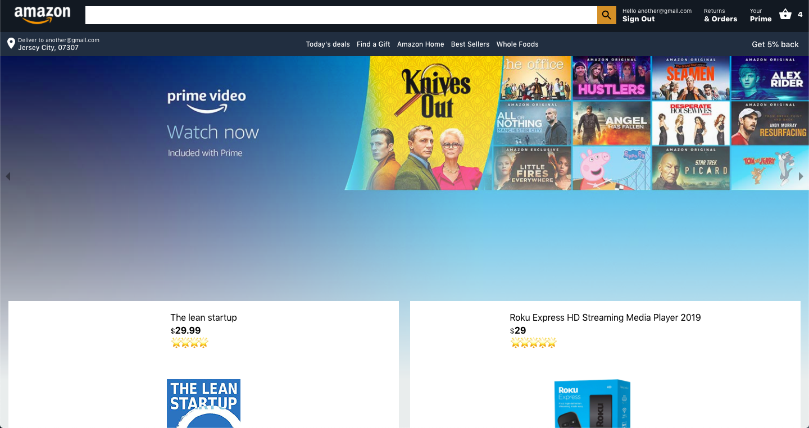
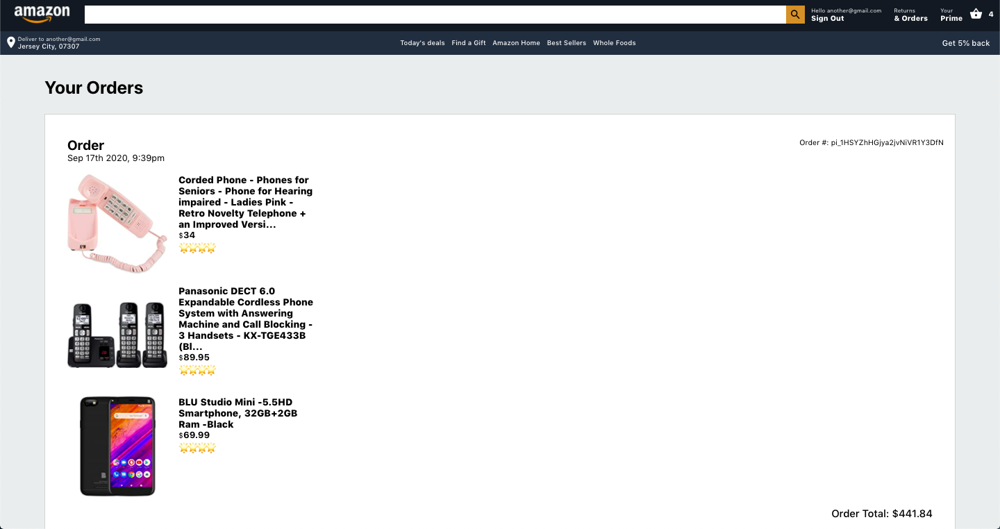
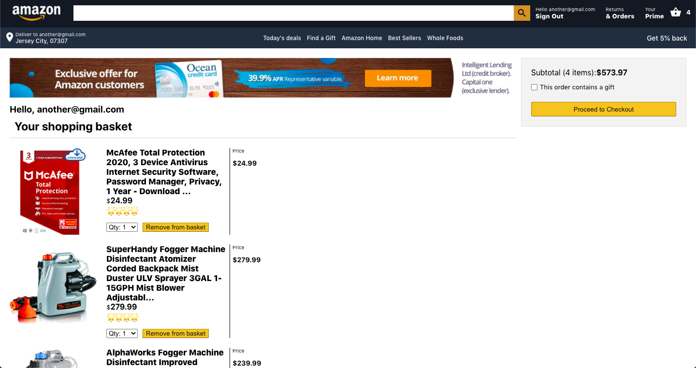

This project was bootstrapped with [Create React App](https://github.com/facebook/create-react-app).

# Amazon Clone 🛒

App emulating Amazon's basic interface. Built with React and Firebase. Express is utilized for handling payments with Stripe API.

*Note: For optimal performance, please utilize on Google Chrome. Styling for mobile devices are not fully supported*

* [Deployed Version](https://clone-7b1aa.web.app/)

*For payment: Stripe API is utilized. PLEASE do not input an actual credit card. For demo purposes, 424242 repeatedly will suffice. :)*

## Home Page Image

## Previous Orders Image

## Cart Image

# Getting Started
Before setting up, make sure Node.js and NPM are installed

## Prerequisites
If it is not installed, install [Node and NPM](https://www.npmjs.com/get-npm)

## Setup

From your terminal,

1. Clone the repo and `cd` into the folder
2. A firebase config is required for this application structure. In `firebase.js`, copy and paste your credentials inside the `firebaseConfig` object.
3. Install dependencies with `npm install`
4. `cd` into `functions` directory and run another `npm install` (this is the server)
5. Inside the `functions` directory, run `firebase emulators:start` to run the server
6. In the root directory, run the react application with `npm run start`

## Current Features
- Users can view products
- Users can create an account
- Users can add products to their cart and purchase the products.
- Payment is simulated through Stripe API.
- Users can view products based on category
- Users can search for products (that exist)

## Tech Stack
- React
- Firebase
- Cloud Firestore

## Tools
- React Router
- React Currency Format
- React Responsive Carousel
- Stripe API
- Axios
- Moment 
- React Notifications Component
- React Elastic Carousel
- React Paginate
- Query String

## Credits
- Images (including items, logos, and home) are from Amazon and are only utilized for demonstration purposes.